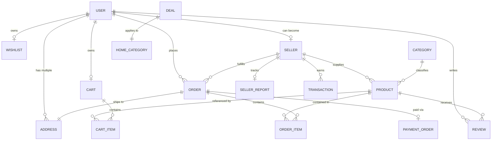
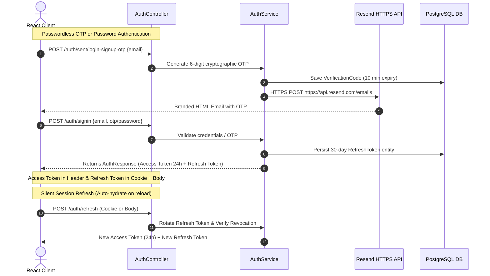

# 🛒 ShopSphere Backend — Enterprise Multi-Vendor E-Commerce Platform

[](https://www.oracle.com/java/)
[](https://spring.io/projects/spring-boot)
[](https://spring.io/projects/spring-security)
[](https://www.postgresql.org/)
[](https://jwt.io/)
[](https://resend.com/)
[](https://ecommerce-multivendor-ywdy.onrender.com)

ShopSphere is an enterprise-ready, multi-vendor e-commerce backend platform engineered with **Java 21** and **Spring Boot 3.3.4**. Designed with clean 3-tier architecture, robust domain modeling, and high-performance transactional services, it powers customer storefronts, independent seller management suites, and super-administrative controls.

---

## 🌐 Live Production Deployment

- **Base Production URL**: `https://ecommerce-multivendor-ywdy.onrender.com`
- **Health Check & Store Status**: `GET https://ecommerce-multivendor-ywdy.onrender.com/home/categories`
- **Hosting Environment**: Render Cloud (Dockerized Spring Boot Web Service with Managed PostgreSQL)

---

## 📑 Table of Contents

- [Architectural Overview](#-architectural-overview)
- [System Capabilities & Core Features](#-system-capabilities--core-features)
- [Domain Model & Entity Relationships](#-domain-model--entity-relationships)
- [Security & Authentication Flow](#-security--authentication-flow)
- [REST API Reference](#-rest-api-reference)
- [Transactional Email Integration](#-transactional-email-integration)
- [Payment Gateways](#-payment-gateways)
- [Configuration & Environment Variables](#-configuration--environment-variables)
- [Local Development & Setup](#-local-development--setup)
- [Testing & Quality Assurance](#-testing--quality-assurance)
- [Author & License](#-author--license)

---

## 🏛️ Architectural Overview

The backend is structured according to domain-driven design and standard Spring 3-tier layered architecture:

```
src/main/java/com/zosh/
├── config/              # Security filter chains, CORS, JWT provider, database initializers
├── controller/          # REST API endpoints (Admin, Seller, Customer, Auth, Payment)
├── domain/              # Enums (AccountStatus, OrderStatus, PaymentMethod, USER_ROLE)
├── dto/ & request/      # Strongly-typed input requests and payloads
├── response/            # Unified API responses and data transfer contracts
├── model/               # JPA Entities mapped to relational database tables
├── repository/          # Spring Data JPA repositories with custom JPQL queries
├── service/             # Business logic interfaces & transaction boundaries
│   ├── ai/              # Gemini AI shopping assistant, context resolution & rate limiting
│   └── impl/            # Production-grade service implementations
├── exceptions/          # Global ControllerAdvice and domain exception handlers
└── utils/               # Cryptographic helpers, OTP generation, and formatting
```

### Architectural Highlights
- **Stateless Authentication**: JWT bearer token validation on incoming requests with zero session stickiness.
- **Database Agnostic**: Fully compatible with both PostgreSQL and MySQL via Spring Data JPA / Hibernate 6 dialect abstractions.
- **Optimistic Locking & Transactions**: `@Transactional` boundaries on order creation, cart clearance, and balance reconciliation.
- **Resilient Cloud Operations**: Built-in cold-start token persistence and dual-channel credential transport.

---

## 🚀 System Capabilities & Core Features

### 1. 👥 Multi-Role User Governance
- **Role-Based Authorization**: Hierarchical RBAC separating `ROLE_CUSTOMER`, `ROLE_SELLER`, and `ROLE_ADMIN`.
- **Customer Storefront**: Profile management, multiple shipping addresses, personalized wishlists, and order histories.
- **Seller Workspace**: Multi-step business verification (GSTIN/PAN, bank accounts, business address), account statuses (`PENDING_VERIFICATION`, `ACTIVE`, `SUSPENDED`, `BANNED`, `CLOSED`).
- **Super Admin Oversight**: Global platform analytics, seller approvals/moderation, category taxonomy configuration, coupon distribution, and deal scheduling.

### 2. 🛍️ Dynamic Product & Category Management
- **Hierarchical Categories**: Level-1 (Primary), Level-2 (Department), and Level-3 (Subcategory) taxonomy with slug generation.
- **Dynamic Homepage Layouts**: Admin-curated sections (`ELECTRIC_CATEGORIES`, `GRID`, `SHOP_BY_CATEGORIES`, `DEALS`).
- **Advanced Product Filtering**: Spring Data JPA `Specification` predicates for dynamic multi-criteria search (category, price bounds, color, sizes, discount thresholds, stock availability, and sorting).
- **Inventory Tracking**: Stock decrement on checkout with automated status reflection (`IN_STOCK` vs. `OUT_OF_STOCK`).

### 3. 🛒 High-Performance Cart & Order Lifecycle
- **Cart Reconciliation**: Automated price synchronization, coupon discount deductions, and quantity validation.
- **Seller Order Splitting**: Multi-item orders spanning multiple independent sellers are automatically partitioned into seller-specific sub-orders with dedicated tracking numbers.
- **Status State Machine**:
  $$	ext{PENDING} \longrightarrow 	ext{PLACED} \longrightarrow 	ext{CONFIRMED} \longrightarrow 	ext{SHIPPED} \longrightarrow 	ext{DELIVERED} \ / \ 	ext{CANCELLED}$$
- **Financial Ledgers**: Per-seller transaction recording, payout tracking, and gross sales reporting (`SellerReportService`).

### 4. 🤖 AI Shopping Assistant
- **Google Gemini Integration**: AI-driven contextual product recommendations and order inquiry resolution.
- **Tool Calling & Session Context**: Maintains contextual chat history, identifies customer intent, and executes real-time catalog search tools.
- **Protection**: IP and user-based `ChatRateLimiter` guarding against token exhaustion.

---

## 🗄️ Domain Model & Entity Relationships



---

## 🔐 Security & Authentication Flow



### Key Security Safeguards
1. **Long-Lived Refresh Protection**: Refresh tokens are cryptographically hashed and tracked in the database, allowing instant server-side revocation.
2. **Dual Transport Architecture**: Supports both HttpOnly `SameSite=None; Secure=true` cookies (for web browsers) and JSON payload tokens (for mobile/external clients).
3. **Password Hashing**: BCrypt with strength factor 12.
4. **CORS Hardening**: Explicit origin whitelisting (`localhost`, production frontends) supporting credentials.

---

## 📡 REST API Reference

### Authentication & Account (`/auth`)
| Method | Endpoint | Access Level | Description |
|---|---|---|---|
| `POST` | `/auth/signup` | Public | Register new customer account |
| `POST` | `/auth/signin` | Public | Authenticate via password or OTP |
| `POST` | `/auth/sent/login-signup-otp` | Public | Dispatch email OTP via Resend |
| `POST` | `/auth/refresh` | Public | Refresh expired access token |
| `POST` | `/auth/logout` | Authenticated | Revoke refresh token and clear cookies |

### Products & Public Catalog (`/products`, `/home`)
| Method | Endpoint | Access Level | Description |
|---|---|---|---|
| `GET` | `/products` | Public | Filtered search (category, price, sort, page) |
| `GET` | `/products/{id}` | Public | Retrieve product details by ID |
| `GET` | `/products/search` | Public | Full-text product search |
| `GET` | `/home/categories` | Public | Fetch dynamic home page category layout |

### Customer Cart & Orders (`/api/cart`, `/api/orders`)
| Method | Endpoint | Access Level | Description |
|---|---|---|---|
| `GET` | `/api/cart` | Customer | Fetch current user cart |
| `PUT` | `/api/cart/add` | Customer | Add item or increment quantity |
| `DELETE` | `/api/cart/item/{id}` | Customer | Remove cart item |
| `POST` | `/api/orders` | Customer | Create order from cart with shipping address |
| `GET` | `/api/orders/user` | Customer | Retrieve user order history |
| `GET` | `/api/orders/{id}` | Customer | Get order details by ID |
| `PUT` | `/api/orders/{id}/cancel` | Customer | Cancel pending/placed order |

### Seller Workspace (`/sellers`, `/api/seller/products`, `/api/seller/orders`)
| Method | Endpoint | Access Level | Description |
|---|---|---|---|
| `POST` | `/sellers` | Authenticated | Submit seller registration & business details |
| `GET` | `/sellers/profile` | Seller | Retrieve seller profile and account status |
| `POST` | `/api/seller/products` | Seller | Create new product catalog item |
| `GET` | `/api/seller/products` | Seller | Fetch all products owned by seller |
| `PUT` | `/api/seller/products/{id}` | Seller | Update product details/stock |
| `DELETE` | `/api/seller/products/{id}` | Seller | Delete product |
| `GET` | `/api/seller/orders` | Seller | View orders assigned to seller |
| `PATCH` | `/api/seller/orders/{id}/status` | Seller | Update fulfillment status (`CONFIRMED`, `SHIPPED`, `DELIVERED`) |
| `GET` | `/api/seller/report` | Seller | Aggregate earnings, revenue, and order metrics |

### Super Administrator (`/api/admin`)
| Method | Endpoint | Access Level | Description |
|---|---|---|---|
| `GET` | `/api/admin/sellers` | Admin | List sellers filtered by status |
| `PATCH` | `/api/admin/sellers/{id}/status` | Admin | Approve, suspend, or ban seller |
| `POST` | `/api/admin/coupons` | Admin | Create discount coupon |
| `GET` | `/api/admin/coupons` | Admin | List all platform coupons |
| `POST` | `/api/admin/deals` | Admin | Create promotional flash deal |
| `PATCH` | `/api/admin/home-categories/{id}` | Admin | Update dynamic homepage category section |

### Payments (`/api/payment`)
| Method | Endpoint | Access Level | Description |
|---|---|---|---|
| `POST` | `/api/payment/{paymentMethod}/order/{orderId}` | Customer | Generate Razorpay / Stripe payment transaction |

---

## 📧 Transactional Email Integration

### Migration from SMTP to Resend HTTPS API
Standard cloud PaaS platforms (including Render Free Web Services) permanently block outbound traffic on SMTP ports (`25`, `465`, and `587`) to prevent spam abuse, leading to `SocketTimeoutException: Connect timed out`.

ShopSphere uses the **Resend Email HTTPS REST API**:
- **Protocol**: Standard Outbound HTTPS (Port 443 — 100% cloud-firewall compliant).
- **Zero Heavy Dependencies**: Powered natively by Java 21's `java.net.http.HttpClient` and Jackson `ObjectMapper`.
- **Security**: Strict zero-leak logging policy (OTPs and API keys are never logged).
- **Configuration**:
  ```properties
  app.email.resend.api-key=${RESEND_API_KEY:}
  app.email.resend.from=${RESEND_FROM_EMAIL:ShopSphere <onboarding@resend.dev>}
  ```

---

## 💳 Payment Gateways

ShopSphere features dual payment gateway orchestration:
1. **Razorpay**:
   - Creates server-side payment orders (`RazorpayClient`).
   - Generates client-ready payment order IDs.
   - Verifies cryptographic payment signatures (`razorpay_signature`) upon completion.
2. **Stripe**:
   - Generates hosted checkout sessions (`SessionCreateParams`).
   - Secure webhooks for asynchronous order reconciliation.

---

## ⚙️ Configuration & Environment Variables

The application is configured via `src/main/resources/application.properties` (local) and `application-prod.properties` (production).

| Variable Name | Required | Default / Example | Purpose |
|---|---|---|---|
| `PORT` | Optional | `5454` | Web server port |
| `DATABASE_URL` | Yes (Prod) | `jdbc:postgresql://host:5432/db` | JDBC database connection string |
| `DATABASE_USERNAME` | Yes (Prod) | `shopsphere_admin` | Database username |
| `DATABASE_PASSWORD` | Yes (Prod) | `••••••••••••` | Database password |
| `JWT_SECRET` | Yes | `64+ character random string` | HMAC-SHA256 signature key |
| `RESEND_API_KEY` | Yes (Prod) | `re_••••••••••••` | Resend HTTPS Email API Key |
| `RESEND_FROM_EMAIL` | Optional | `ShopSphere <onboarding@resend.dev>` | Verified sender address |
| `RAZORPAY_API_KEY` | Optional | `rzp_test_••••••••` | Razorpay public key |
| `RAZORPAY_API_SECRET` | Optional | `••••••••••••` | Razorpay secret key |
| `STRIPE_API_KEY` | Optional | `sk_test_••••••••` | Stripe API secret |
| `GEMINI_API_KEY` | Optional | `AIza••••••••` | Google Gemini API key for AI assistant |

---

## 💻 Local Development & Setup

### Prerequisites
- **Java**: JDK 21 or higher
- **Build Tool**: Apache Maven 3.9+
- **Database**: PostgreSQL 15+ or MySQL 8+
- **IDE**: IntelliJ IDEA, Eclipse, or VS Code with Spring Boot Extension Pack

### Installation Steps

1. **Clone the repository**:
   ```bash
   git clone https://github.com/yourusername/ecommerce_multivendor.git
   cd ecommerce_multivendor
   ```

2. **Configure Database**:
   Create a local database:
   ```sql
   CREATE DATABASE ecommerce_multivendor;
   ```
   Update `src/main/resources/application.properties` with your credentials or export environment variables:
   ```bash
   export DATABASE_URL=jdbc:mysql://localhost:3306/ecommerce_multivendor
   export DATABASE_USERNAME=root
   export DATABASE_PASSWORD=your_password
   ```

3. **Build the Application**:
   ```bash
   mvn clean package -DskipTests
   ```

4. **Run the Application**:
   ```bash
   mvn spring-boot:run
   ```
   The server will start at `http://localhost:5454`.

---

## 🧪 Testing & Quality Assurance

ShopSphere includes a comprehensive unit and integration test suite verifying controllers, business services, token refresh cycles, and email delivery:

```bash
# Execute full test suite
mvn test -Dtest="!EcommerceMultivendorApplicationTests"
```

### Test Coverage Highlights
```text
[INFO] Running com.zosh.controller.AuthControllerTest (6 tests) - PASSED
[INFO] Running com.zosh.service.EmailServiceTest (4 tests) - PASSED
[INFO] Running com.zosh.service.impl.AuthServiceImplTest (8 tests) - PASSED
[INFO] Running com.zosh.service.RefreshTokenServiceTest (7 tests) - PASSED
[INFO] Running com.zosh.service.ai.* (33 tests) - PASSED
[INFO] Running com.zosh.service.impl.* (36 tests) - PASSED
[INFO] 
[INFO] Results:
[INFO] Tests run: 94, Failures: 0, Errors: 0, Skipped: 0
[INFO] BUILD SUCCESS
```

---

## 👨‍💻 Author & Acknowledgments

**Yash Sunil Lodam**  
*Full Stack Software Engineer & Solution Architect*  
- **Specialization**: Enterprise Java, Spring Boot Microservices, Cloud Infrastructure, React Full-Stack.
- **GitHub**: [@yashlodam](https://github.com/yashlodam)

---

## 📄 License

This project is licensed under the **MIT License**. Feel free to use, modify, and distribute this software for educational and commercial applications.
